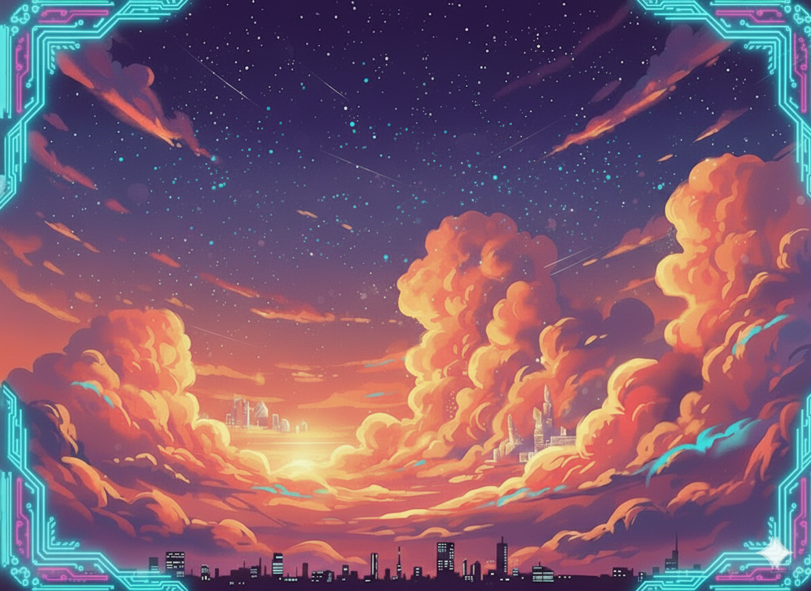

#   Project Game Arkanoid


> Một phiên bản hiện đại của tựa game phá gạch (Brick Breaker) cổ điển, được xây dựng bằng [Java - GDX].


## 🧑‍💻 Tác giả

Group 9 - Fantastic Four

1. Nguyễn Thành Đô - 24020070
2. Nguyễn Đình Công Huy - 24020160
3. Đào Mạnh Hải Long - 24020205
4. Nguyễn Hoàng Đức - 24020079

**Instructor:** Tô Văn Khánh - Kiều Văn Tuyên - Trương Xuân Hiếu
**Semester:** HK1 - Năm học 2025-2026


---

## 🌟 Giới thiệu

Chào mừng thầy, cô . Đây là một dự án game được phát triển với niềm đam mê, tái hiện lại lối chơi "Arkanoid" kinh điển. Nhiệm vụ của người chơi là điều khiển một thanh trượt (paddle) để đỡ một quả bóng, phá hủy tất cả các viên gạch ở phía trên màn hình mà không để bóng rơi xuống.

## ✨ Tính năng nổi bật

* **Lối chơi cổ điển gây nghiện:** Dễ chơi nhưng khó để thành thạo.
* **Hệ thống màn chơi (Levels):** 3 màn chơi được thiết kế thủ công với độ khó tăng dần.
* **Vật phẩm (Power-ups) đa dạng:**
    * 🛡️ **Thanh trượt dài (Wide Paddle):** Giúp bạn đỡ bóng dễ dàng hơn.
    * 🔥 **Giảm tốc độ bóng (Slow Ball):** Giảm tốc độ giúp màn chơi dễ dàng
    * 💥 **Nhân đôi điểm (Double Score)** Nhân đôi điểm trong thời gian giới hạn
    * ❤️ **Thêm mạng (Extra Lives):** Cơ hội để bạn tiếp tục.
 
* **Vật phẩm (Power-down) giúp tăng độ khó:**
    * 🔥 **Tăng tốc độ bóng (Slow Ball):** Tăng tốc độ giúp tăng dộ khó màn chơi
    * 💥 **Giảm số mạng sống(Lose Lives)** giảm số mạng sống
    * 🛡️ **Thu nhỏ thanh đỡ:** Làm hạn chế khả năng đỡ trúng bóng
  
* **Đồ họa & Âm thanh:** Đồ họa 2D Phong cách đồ họa, pixel art, hiện đại... bắt mắt cùng hiệu ứng âm thanh sống động.
* **Hệ thống bảng xếp hạng:** Thử thách bản thân để đạt điểm số cao nhất!


## Class Diagram (Sơ đồ lớp)

[Nhấp vào đây để xem Sơ đồ lớp](https://drive.google.com/file/d/1PbJ80h1iBk3NW4A8u2Tc-Wv2doWmVbJK/view)

## 📸 Hình ảnh trong game

| Màn hình chính 1 | Màn hình chính 2 | Gameplay 2 (Vật phẩm) |
| :---: | :---: | :---: |
|  |  |  |


## 💻 Công nghệ sử dụng

Dự án này được xây dựng hoàn toàn bằng:

* **Ngôn ngữ lập trình:**  Java
* **Framework / Game Engine:** LibGDx
* **Công cụ phát triển:** IntelliJ IDEA / Visual Studio / VS Code 
* **Thiết kế đồ họa:** Genmini , printerest
* **Thiết kế âm thanh:**  Internet

## 🛠️ Cài đặt và Chạy dự án

Bạn có thể tự mình chạy và trải nghiệm game bằng các bước sau:

### Yêu cầu hệ thống

* Hệ điều hành : Các hệ điều hành Window (10,11,...)
* Runtime cần thiết, ví dụ: Java JRE 11 trở lên

### Hướng dẫn cài đặt

1.  **Clone (Sao chép) repository:**
    ```bash
    https://github.com/CongHuy-24020160/Game_Java
    ```

2.  **Đi đến thư mục dự án:**
    ```bash
    https://github.com/CongHuy-24020160/Game_Java/tree/test_game
    ```


3.  **Chạy dự án:**
    *"Chạy file `DesktopLauncher.java`")*


## 🎮 Cách chơi

* **Di chuyển thanh trượt:** Dùng **Chuột** hoặc phím **Mũi tên Trái/Phải**.
* **Bắt đầu game:** Nhấn phím **Space** (hoặc click chuột) để thả bóng.
* **Mục tiêu:** Phá hủy tất cả gạch trên màn hình để qua màn.
* **Pause Game** Ấn P để dừng game và hiện hộp thoại Pause
* **Thua cuộc:** Nếu bóng rơi xuống dưới cùng, bạn sẽ mất một mạng. Game kết thúc khi bạn hết mạng.


## Cải tiến trong tương lai (Future Improvements)

### Các tính năng dự kiến (Planned Features)

1.  **Các chế độ chơi bổ sung**
    * Chế độ tấn công thời gian (Time attack)
    * Chế độ sinh tồn với màn chơi vô tận
    * Chế độ chơi phối hợp (Co-op multiplayer)

2.  **Cải tiến lối chơi (Enhanced gameplay)**
    * Các trận đấu trùm (Boss) ở cuối mỗi màn/thế giới
    * Thêm nhiều loại vật phẩm tăng sức mạnh (ví dụ: đóng băng thời gian, tường khiên, v.v.)
    * Hệ thống thành tích (Achievements)

3.  **Cải tiến kỹ thuật (Technical improvements)**
    * Triển khai chế độ chơi với đối thủ AI
    * Thêm bảng xếp hạng trực tuyến với cơ sở dữ liệu (database backend)


## 🤝 Cách đóng góp

Nếu bạn muốn đóng góp cho dự án, vui lòng "Fork" repository này và tạo một "Pull Request" với những thay đổi của bạn. Mọi sự đóng góp đều được trân trọng!


## Giấy phép (License)

Dự án này được phát triển chỉ nhằm mục đích giáo dục.

**Tính chính trực trong học thuật (Academic Integrity):** Mã nguồn này được cung cấp dưới dạng tham khảo. Vui lòng tuân thủ các chính sách về tính chính trực trong học thuật của cơ sở giáo dục của bạn.

---

## Lời cảm ơn (Acknowledgements)

Chúng em xin gửi lời cảm ơn chân thành đến giảng viên hướng dẫn, vì sự hướng dẫn tận tình và hỗ trợ quý báu của thầy/cô trong suốt quá trình thực hiện dự án này.


